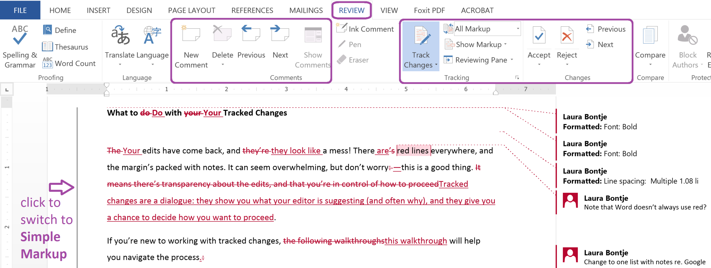
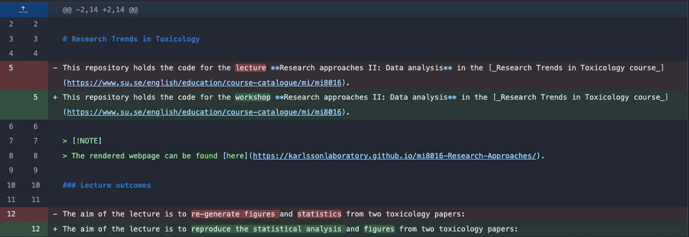
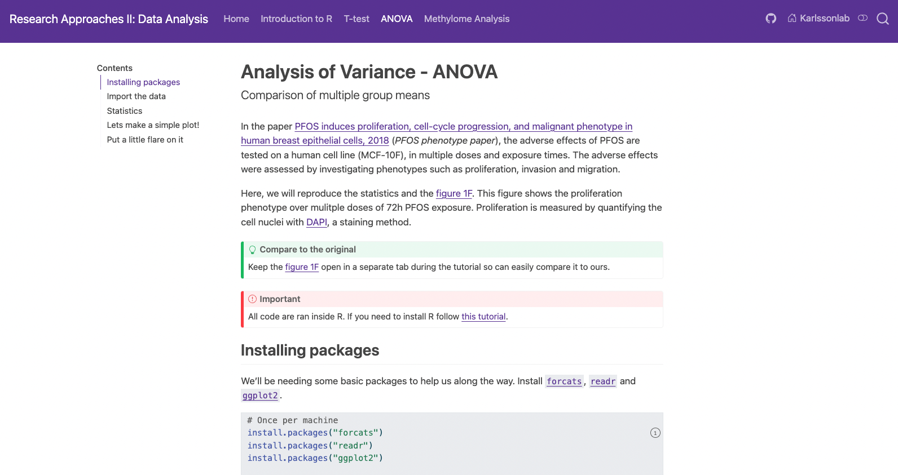

## Quarto is a software tool that . . . <!-- What is Quarto -->

::: {.incremental}

+ Interactive reports
+ Computation inside the file!
+ Written in `Markdown` format
+ `Inline code`
+ Open-source

:::

```{r}
library(tidyverse)
data <- data.frame(value = rnorm(500))
ojs_define(hist_data = data)
```

::: {.fragment style="position: absolute; bottom: 0px; left: 0px; width: 50%;"}

```{ojs}
//| echo: false
viewof bins = Inputs.range([5, 100], {value: 30, step: 5, label: "Bins:"})

data = transpose(hist_data)

Plot.plot({
  marks: [
    Plot.rectY(data, Plot.binX({y: "count"}, {
      x: d => d.value,
      thresholds: bins,
      fill: "steelblue",
      stroke: "black"
    }))
  ],
  style: {background: "transparent", color: "white", fontSize: 18}
})
```

:::

::: {.fragment style="position: absolute; bottom: 0px; right: 0px; width: 50%;"}

```{r}
ojs_define(iris_data = iris)
```

```{ojs}
//| echo: false

viewof species = Inputs.checkbox(
  ["setosa", "versicolor", "virginica"],
  {value: ["setosa", "versicolor", "virginica"], label: "Species:"}
)

idata = transpose(iris_data)
filtered = idata.filter(d => species.includes(d.Species))

colors = ({setosa: "steelblue", versicolor: "orange", virginica: "mediumseagreen"})

Plot.plot({
  marks: [
    Plot.boxY(filtered, {
      x: d => d.Species,
      y: d => d["Sepal.Length"],
      fill: d => d.Species,
      stroke: "black"
    })
  ],
  x: {label: "Species"},
  y: {label: "Sepal Length"},
  color: {range: ["steelblue", "orange", "mediumseagreen"]},
  style: {background: "transparent", color: "white", fontSize: 16},
  marginBottom: 40,
  marginLeft: 50
})
```

:::

# 1. The [Anatomy]{style="color: red; font-family: 'Playfair Display', serif; font-style: italic;"} of a Quarto file {style="font-size: 0.7em; text-align: center;" auto-animate="true"}

::: {.slide transition="zoom-in none-out"}

## The [Anatomy]{style="color: red; font-family: 'Playfair Display', serif; font-style: italic;"} of a Quarto file <!-- HEADER -->

````{.md filename="report_file.qmd" code-line-numbers=""}
---
title: "Results!"
format: html
Author: "Andrey Höglund"
date: Today
---

# The results

The main results of the analysis were ...

```{{r}}
plot(1:10)
```
````

:::

## The [Anatomy]{style="color: red; font-family: 'Playfair Display', serif; font-style: italic;"} of a Quarto file <!-- HEADER -->

````{.md filename="report_file.qmd" code-line-numbers="1-6"}
---
title: "Results!"
format: html
Author: "Andrey Höglund"
date: Today
---

# The results

The main results of the analysis were ...

```{{r}}
plot(1:10)
```
````

<br>

+ YAML header (file's meta data)

## The [Anatomy]{style="color: red; font-family: 'Playfair Display', serif; font-style: italic;"} of a Quarto file <!-- HEADER -->

````{.md filename="report_file.qmd" code-line-numbers="8-10"}
---
title: "Results!"
format: html
Author: "Andrey Höglund"
date: Today
---

# The results

The main results of the analysis were ...

```{{r}}
plot(1:10)
```
````

<br>

+ YAML header (file's meta data)
+ Markdown

## The [Anatomy]{style="color: red; font-family: 'Playfair Display', serif; font-style: italic;"} of a Quarto file <!-- HEADER -->

````{.md filename="report_file.qmd" code-line-numbers="11-14"}
---
title: "Results!"
format: html
Author: "Andrey Höglund"
date: Today
---

# The results

The main results of the analysis were ...

```{{r}}
plot(1:10)
```
````

<br>

+ YAML header (file's meta data)
+ Markdown
+ `code chunks`

# 2. Running _`code`_ inside a Quarto file {style="font-size: 0.6em; text-align: center;" auto-animate="true"}

::: {.slide transition="zoom-in none-out"}

## Running _`code`_ inside a Quarto file

````{.md filename="report_file.qmd" code-line-numbers="|1-6|2,8-10|2,12-14|2,16-18"}

These code chucks will be executed with:

```{{r}}
# R
```

```{{python}}
# Python
```

```{{julia}}
# Julia
```

```{{ojs}}
# Observable
```


````

:::

## Running _`code`_ inside a Quarto file

````{.md filename="script.R" code-line-numbers="|3"}
```{{r}}
# Air particle measurements in a vector
measurements <- c(10, 15, 20, 33, 50, 32, 49, 18, 30, 54, 23)
```
````

:::: {style="position: absolute; bottom: 30px; width: 100%;"}
::: {.callout-tip}
Quarto renders a file in the same manner as a jupyter notebook
:::
::::

## Running _`code`_ inside a Quarto file

````{.md filename="script.R" code-line-numbers=4}
```{{r}}
# Air particle measurements in a vector
measurements <- c(10, 15, 20, 33, 50, 32, 49, 18, 30, 54, 23)
length(measurements)
sum(measurements)
```
````

```{r}
measurements <- c(10, 15, 20, 33, 50, 32, 49, 18, 30, 54, 23)
length(measurements)
```

:::: {style="position: absolute; bottom: 30px; width: 100%;"}
::: {.callout-tip}
Quarto renders a file in the same manner as a jupyter notebook
:::
::::

## Running _`code`_ inside a Quarto file

````{.md filename="script.R" code-line-numbers=5}
```{{r}}
# Air particle measurements in a vector
measurements <- c(10, 15, 20, 33, 50, 32, 49, 18, 30, 54, 23)
length(measurements)
sum(measurements)
```
````

```{r}
sum(measurements)
```

:::: {style="position: absolute; bottom: 30px; width: 100%;"}
::: {.callout-tip}
Quarto renders a file in the same manner as a jupyter notebook
:::
::::

## Running _`code`_ inside a Quarto file

````{.md filename="script.R" code-line-numbers="4|7|9|11"}

```{{r}}
# Air particle measurements in a vector
measurements <- c(10, 15, 20, 33, 50, 32, 49, 18, 30, 54, 23)
```

We collected `{{r}} length(measurements)` measurements.

The average was `{{r}} mean(measurements)`.

And the total sum was `{{r}} sum(measurements)`.

````

:::: {style="position: absolute; bottom: 30px; width: 100%;"}
::: {.callout-tip}
`Inline code` - do some calculation and present in the text
:::
::::

## Running _`code`_ inside a Quarto file

````{.md filename="script.R" code-line-numbers="7-11"}

```{{r}}
# Air particle measurements in a vector
measurements <- c(10, 15, 20, 33, 50, 32, 49, 18, 30, 54, 23)
```

We collected `{{r}} length(measurements)` measurements.

The average was `{{r}} mean(measurements)`.

And the total sum was `{{r}} sum(measurements)`.

````

```{r}
measurements <- c(10, 15, 20, 33, 50, 32, 49, 18, 30, 54, 23)
```

We collected `r length(measurements)` measurements.

The average was `r mean(measurements)`.

And the total sum was `r sum(measurements)`.

:::: {style="position: absolute; bottom: 30px; width: 100%;"}
::: {.callout-tip}
`Inline code` - do some calculation and present in the text
:::
::::

## Running _`code`_ inside a Quarto file

````{.md filename="script.R" code-line-numbers="4"}

```{{r}}
# Air particle measurements in a vector
measurements <- c(10, 15, 20, 33, 50, 32, 49, 18, 30, 54, 23, 20, 54, 43, 23, 1, 3, 8, 83, 58, 58, 39)
```

We collected `{{r}} length(measurements)` measurements.

The average was `{{r}} mean(measurements)`.

And the total sum was `{{r}} sum(measurements)`.

````

:::: {style="position: absolute; bottom: 30px; width: 100%;"}
::: {.callout-tip}
`Inline code` - do some calculation and present in the text
:::
::::

## Running _`code`_ inside a Quarto file

````{.md filename="script.R" code-line-numbers="7-11"}

```{{r}}
# Air particle measurements in a vector
measurements <- c(10, 15, 20, 33, 50, 32, 49, 18, 30, 54, 23, 20, 54, 43, 23, 1, 3, 8, 83, 58, 58, 39)
```

We collected `{{r}} length(measurements)` measurements.

The average was `{{r}} mean(measurements)`.

And the total sum was `{{r}} sum(measurements)`.

````

```{r}
measurements <- c(10, 15, 20, 33, 50, 32, 49, 18, 30, 54, 23, 20, 54, 43, 23, 1, 3, 8, 83, 58, 58, 39)
```

We collected `r length(measurements)` measurements.

The average was `r mean(measurements)`.

And the total sum was `r sum(measurements)`.

:::: {style="position: absolute; bottom: 30px; width: 100%;"}
::: {.callout-tip}
`Inline code` - do some calculation and present in the text
:::
::::

# 3. Version control - Git

::: {.slide transition="zoom-in none-out"}

## Version control - Git

Version control is [not]{style="color: red; font-family: 'Playfair Display', serif; font-style: italic;"} track changes

[]{.fragment}

:::

## Version control - Git

Since a Quarto file is _plain text_ we can track all changes with version control

[]{.fragment}

## Conclusion

[Webpages]{.fragment fragment-index=1}<br>
[Reports]{.fragment fragment-index=2}<br>
[Presentations (like this one)]{.fragment fragment-index=3}<br>
[Articles]{.fragment fragment-index=4}<br>
[Your kappa?!]{.fragment fragment-index=5}<br>

[]{.fragment fragment-index=1 style="position: absolute; top: 50px; right: 0px; width: 65%;"}